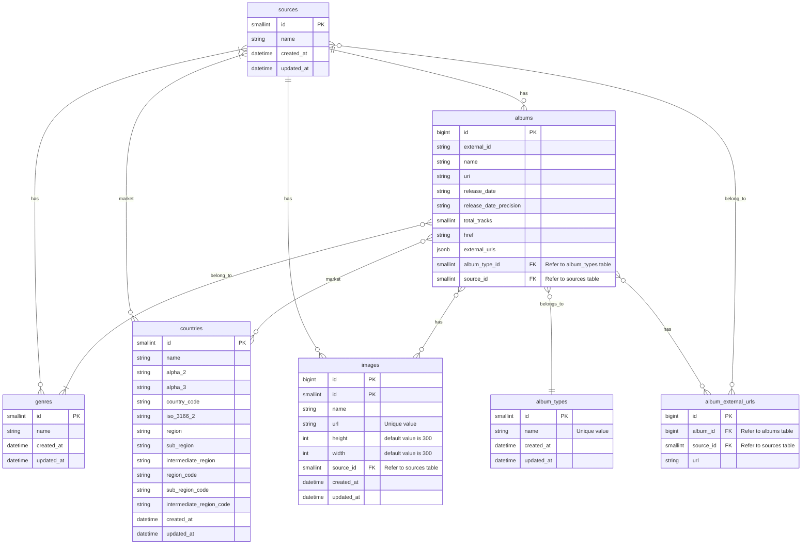

# Entity Relationship Diagram

```mermaid
erDiagram
    sources {
        smallint id PK
        string name
        datetime created_at
        datetime updated_at
    }

    sources }|--o{ genres : has
    genres {
        smallint id PK
        string name
        datetime created_at
        datetime updated_at
    }

    sources }|--o{ countries : market
    countries {
        smallint id PK
        string name
        string alpha_2
        string alpha_3
        string country_code
        string iso_3166_2
        string region
        string sub_region
        string intermediate_region
        string region_code
        string sub_region_code
        string intermediate_region_code
        datetime created_at
        datetime updated_at
    }

    sources ||--o{ images: has
    images {
        bigint id PK
        smallint id PK
        string name
        string url "Unique value"
        int height "default value is 300"
        int width "default value is 300"
        smallint source_id FK "Refer to sources table"
        datetime created_at
        datetime updated_at
    }

    album_types {
        smallint id PK
        string name "Unique value"
        datetime created_at
        datetime updated_at
    }

    sources ||--o{ albums: has
    albums }o--|| album_types: belongs_to
    albums }o--|{ genres : belong_to
    albums }o--o{ countries: market
    albums }o--o{ images: has
    albums {
        bigint id PK
        string external_id
        string name
        string uri
        string release_date
        string release_date_precision
        smallint total_tracks
        string href
        jsonb external_urls
        smallint album_type_id FK "Refer to album_types table"
        smallint source_id FK "Refer to sources table"
    }

    albums }o--o{ album_external_urls: has
    album_external_urls }o--o{ sources: belong_to
    album_external_urls {
        bigint id PK
        bigint album_id FK "Refer to albums table"
        smallint source_id FK "Refer to sources table"
        string url
    }
```
